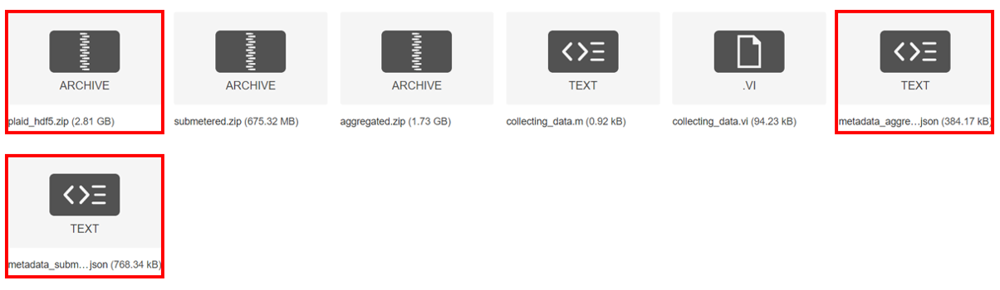

# PLAID 2018
[下載網址](https://figshare.com/articles/dataset/PLAID_-_A_Voltage_and_Current_Measurement_Dataset_for_Plug_Load_Appliance_Identification_in_Households/10084619)

## 下載項目


## 使用方法 
1. 將 `plaid_new_.hdf5` 、 `metadata_aggregated.json` 、 `metadata_submetered.json` 放在同一個資料夾。
2. 將 `plaid_2018.py` 內的路徑改成 `使用方法 1` 的資料夾路徑。
  ```python
  ## plaid_2018.py
  ########################################  修改成自己的路徑

  plaid_hdf5_path = r"D:\NILM\dataset\plaid\2018/plaid_new_.hdf5"
  aggregated_json_path=r"D:\NILM\dataset\plaid\2018/metadata_aggregated.json"
  submetered_json_path = r"D:\NILM\dataset\plaid\2018/metadata_submetered.json"

  ########################################
  ```
3. 使用 `plaid_2018.py` 的 `ReadPLAID_2018()`方法
```python
obj = ReadPLAID_2018()
## Aggregated
aggregated_waves, aggregated_infos = obj.getAggregated()

## Submetered
submetered_waves, submetered_infos = obj.getSubmetered()
```

## 數據格式介紹
### Aggregated
``` 設備名稱 : 數量
{'Fan': 101, 
 'Vacuum': 98,
 'Coffee maker': 106,
 'Incandescent Light Bulb': 112,
 'Air Conditioner': 159,
 'Water kettle': 110,
 'Fridge': 79,
 'Fridge defroster': 88,
 'Compact Fluorescent Lamp': 103,
 'Hair Iron': 97,
 'Iron solder': 109,
 'Laptop': 90,
 'Blender': 51}
```
* <b>aggregated_waves</b>
  * 有 <b>575</b> 個聚合負載的電壓、電流波型。
    <br>ex: 取出第 n 個 聚合負載 的電壓、電流波型 :
    <br>`voltage_wave, current_wave = aggregated_waves[n-1][0], aggregated_waves[n-1][1]`
* <b>aggregated_infos</b>
  <br>以下是第 n 個 聚合負載的資訊 : 
  <br>(備註: datas 裡面的 on 會放在list裡面是因為 Iron solder設備的on有兩個階段，所以會有兩個值，其他則為一個值)
  <table>
    <tr>
        <th>語法</th>
        <th>數據格式</th>
    </tr>
    <tr>
        <td>aggregated_infos[n-1]["<b>datas</b>"]</td>
        <td>[ [[on], off, 設備1名稱], [[on], off, 設備m名稱] ]</td>
    </tr>
    <tr>
        <td>aggregated_infos[n-1]["<b>labels</b>"]</td>
        <td>[設備1名稱, 設備m名稱]</td>
    </tr>
    <tr>
        <td>aggregated_infos[n-1]["<b>events</b>"]</td>
        <td>[on、off的所有集合(不分on、off)]</td>
    </tr>
    <tr>
        <td>aggregated_infos[n-1]["<b>sampling_frequency</b>"]</td>
        <td>int: 30000</td>
    </tr>
    <tr>
        <td>aggregated_infos[n-1]["<b>cost_time</b>"]</td>
        <td>int: 波型總時間</td>
    </tr>
    <tr>
        <td>aggregated_infos[n-1]["<b>house</b>"]</td>
        <td>str: 從哪個房子收集到的</td>
    </tr>    
</table>

### Submetered
```
{'Compact Fluorescent Lamp': 230,
 'Fridge': 108,
 'Hairdryer': 246,
 'Air Conditioner': 204,
 'Laptop': 216,
 'Microwave': 200,
 'Vacuum': 83,
 'Incandescent Light Bulb': 157,
 'Fan': 220,
 'Washing Machine': 75,
 'Heater': 85,
 'Coffee maker': 10,
 'Water kettle': 10,
 'Hair Iron': 10,
 'Soldering Iron': 20,
 'Blender': 2}
```

* <b>submetered_waves</b>
  * 有 <b>1876</b> 個單一負載的電壓、電流波型。
    <br>ex: 取出第 n 個 聚合負載 的電壓、電流波型 :
    <br>`voltage_wave, current_wave = submetered_waves[n-1][0], submetered_waves[n-1][1]`
* <b>submetered_infos</b>
  <br>以下是第 n 個 單一負載的資訊 : 
  <table>
    <tr>
        <th>語法</th>
        <th>數據格式</th>
    </tr>
  
    <tr>
        <td>submetered_infos[n-1]["<b>label</b>"]</td>
        <td>str: 設備名稱</td>
    </tr>
    <tr>
        <td>submetered_infos[n-1]["<b>status</b>"]</td>
        <td>str: 設備狀態</td>
    </tr>
    <tr>
        <td>submetered_infos[n-1]["<b>sampling_frequency</b>"]</td>
        <td>int: 30000</td>
    </tr>
    <tr>
        <td>submetered_infos[n-1]["<b>cost_time</b>"]</td>
        <td>int: 波型總時間</td>
    </tr>
    <tr>
        <td>submetered_infos[n-1]["<b>house</b>"]</td>
        <td>str: 從哪個房子收集到的</td>
    </tr>    
</table>
